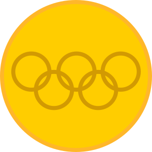
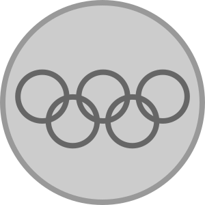
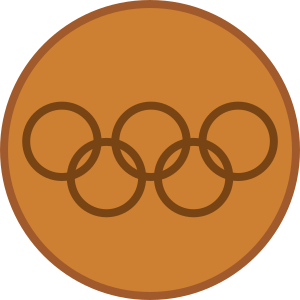
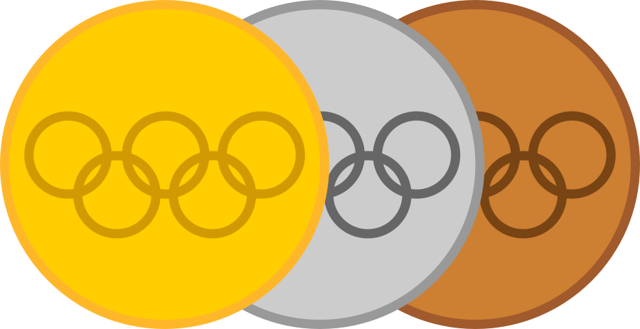

# Time Olímpico do Brasil - Atividade Avaliativa

## Descrição

Este projeto é um site informativo sobre o Time Olímpico do Brasil, focado nos Jogos Olímpicos de Paris 2024. O site destaca informações sobre os atletas brasileiros, tanto de esportes coletivos quanto individuais, e fornece notícias atualizadas sobre as competições e resultados. O objetivo é oferecer aos usuários uma plataforma completa para acompanhar o desempenho do Brasil nas Olimpíadas.

## Estrutura do Site

O site é dividido em várias páginas, cada uma com foco em diferentes aspectos da participação brasileira nos Jogos Olímpicos:

- **index.html**: Página principal, que dá as boas-vindas ao usuário e oferece um formulário para enviar mensagens de apoio aos atletas e receber notícias via e-mail.
- **atletas.html**: Detalha alguns dos principais atletas brasileiros, como Rebeca Andrade, Rayssa Leal, e Darlan, com suas conquistas e perfis.
- **coletivas.html**: Focada nos esportes coletivos, como vôlei, futebol, e basquete, apresentando tabelas de medalhas conquistadas por cada modalidade.
- **individuais.html**: Apresenta informações sobre os esportes individuais, como judô, vela, atletismo, e vôlei de praia, incluindo tabelas de medalhas.
- **news.html**: Seção de notícias, com atualizações sobre os resultados mais recentes e momentos marcantes dos atletas brasileiros.

## Recursos Utilizados

### Tabelas de Medalhas

Nas páginas de esportes coletivos e individuais, foram incluídas tabelas que detalham as conquistas dos atletas brasileiros em cada modalidade. As tabelas mostram o número de medalhas de ouro, prata e bronze, bem como o total de medalhas conquistadas.

Exemplo de tabela utilizada na página **coletivas.html**:

```html
<table border="1">
  <thead>
    <tr>
      <th>Categoria</th>
      <th></th>
      <th></th>
      <th></th>
      <th></th>
    </tr>
  </thead>
  <tbody>
    <tr>
      <td>Voleibol Masculino</td>
      <td>3</td>
      <td>3</td>
      <td>2</td>
      <td>8</td>
    </tr>
    <tr>
      <td>Voleibol Feminino</td>
      <td>2</td>
      <td>2</td>
      <td>0</td>
      <td>4</td>
    </tr>
  </tbody>
</table>
```
### Gráficos e Imagens

Para melhorar a experiência visual do usuário, o site utiliza gráficos e imagens ilustrativas. Por exemplo:

- **Ícones de Medalhas**: Pequenos ícones de medalhas são usados nas tabelas para representar ouro, prata e bronze. Isso ajuda a destacar as conquistas dos atletas de forma clara e visualmente atraente.

Exemplo de como as medalhas são exibidas:

  

### Arquivos CSS

O estilo do site é gerenciado por um arquivo CSS localizado na pasta `/css/`. Este arquivo controla o layout, as cores, as fontes e outros aspectos visuais do site para garantir uma aparência coesa e profissional.


## Implementação de Design Responsivo

O site é totalmente responsivo, garantindo que ele funcione bem em dispositivos móveis, tablets e desktops. Isso é conseguido através do uso de media queries no CSS, permitindo que o layout e os elementos gráficos se ajustem automaticamente ao tamanho da tela do dispositivo.

## Melhoria Contínua

O desenvolvimento do site é um processo contínuo, com atualizações regulares para melhorar a funcionalidade e a usabilidade. Feedback de usuários é sempre bem-vindo para fazer ajustes e adicionar novas funcionalidades conforme necessário.

## Conclusão

Este projeto visa fornecer uma plataforma abrangente para que os brasileiros acompanhem o desempenho de seus atletas nos Jogos Olímpicos de Paris 2024. Com uma combinação de informações detalhadas, tabelas de medalhas, notícias atualizadas e um design responsivo, o site oferece uma experiência completa e envolvente para todos os fãs do esporte olímpico.
